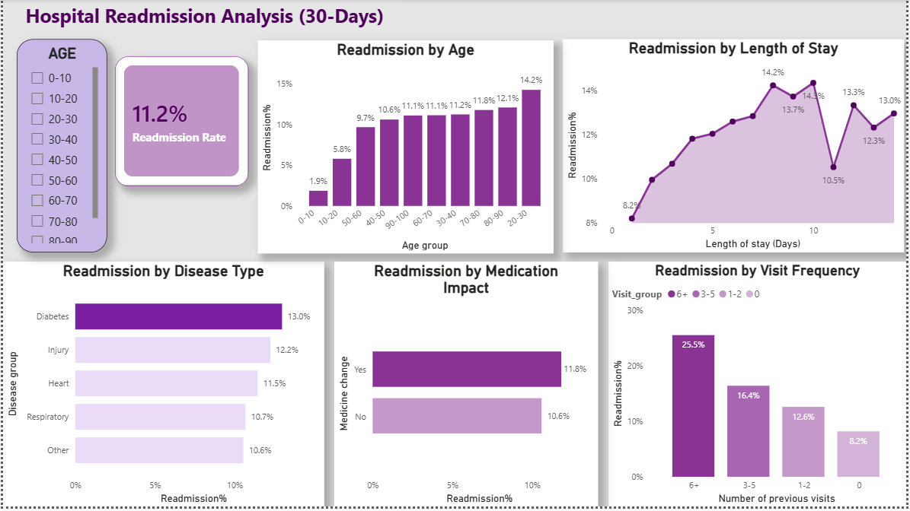
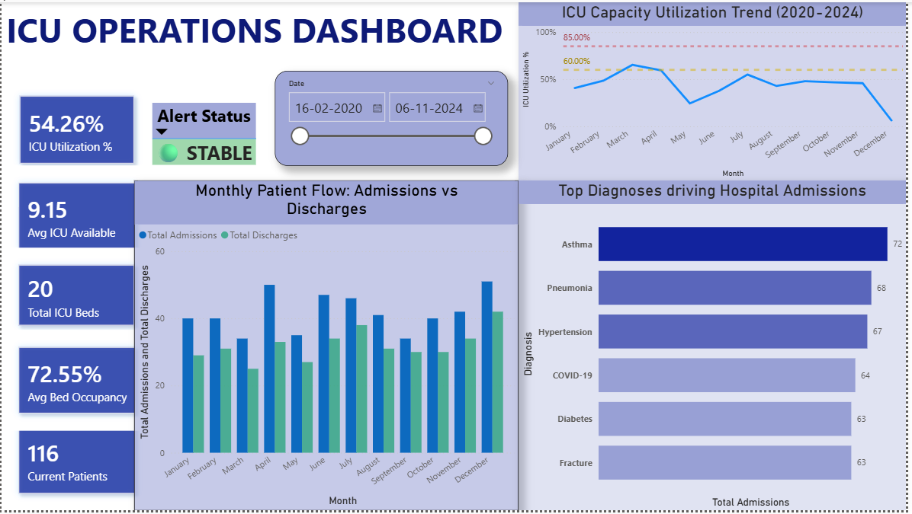
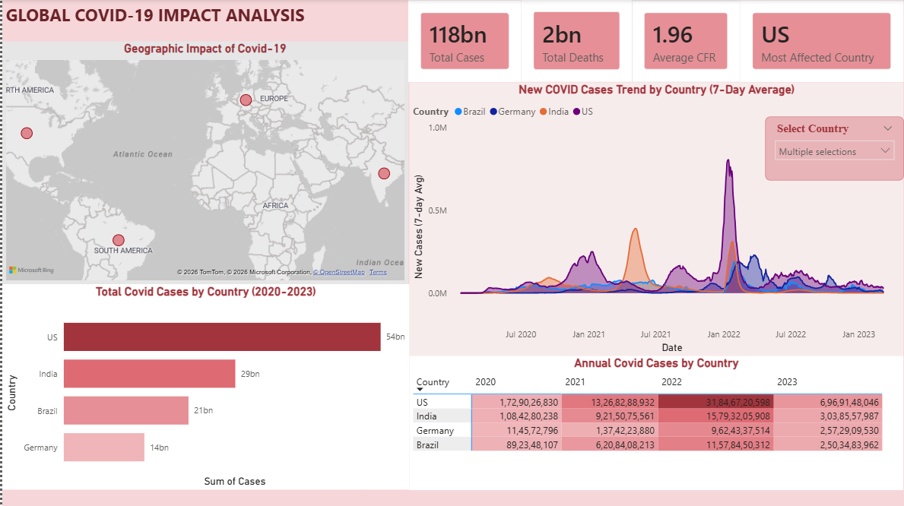

# 🏥 Healthcare Data Analytics Portfolio
### Gopika | Fresher Data Analyst | Power BI Developer

---

## About This Portfolio
I built these 3 end-to-end Power BI dashboards independently using public Kaggle datasets.
Each project covers a different area of healthcare analytics — from patient readmissions
to ICU capacity to global disease surveillance.

**Tools used:** Kaggle · Excel · Power Query · Power BI · DAX · SQL (WHERE, JOIN)

---

## 📁 Projects

### 01 — Hospital Readmissions Dashboard
- Analysed 30-day readmission patterns across age, disease type, and visit frequency
- Found that patients with 6+ prior visits had a 25.5% readmission rate
- Diabetes was the highest-risk disease group at 13%

---

### 02 — ICU Operations Dashboard
- Tracked ICU utilisation, bed occupancy, and patient flow (2020–2024)
- Discovered hidden stress periods where ICU resources were critical
  even when overall hospital occupancy looked manageable
- Top admission drivers: Asthma (72), Pneumonia (68), Hypertension (67)

---

### 03 — Disease Surveillance Dashboard
- Tracked global COVID-19 spread across 4 countries (2020–2023)
- Built 7-day average trend lines and geographic impact maps
- US accounted for 54bn of total tracked cases

---

## 📄 Full Portfolio Document
Download the full case study PDF here → [gopika_portfolio.pdf](gopika_portfolio.pdf)

---

## 🛠 Skills Demonstrated
| Area | Tools |
|------|-------|
| Data Source | Kaggle (public datasets) |
| Data Cleaning | Microsoft Excel, Power Query |
| Visualisation | Power BI Desktop |
| Calculations | DAX — measures, calculated columns |
| Database | SQL — SELECT, WHERE, JOIN, GROUP BY |

---

*Open to entry-level Data Analyst / BI Developer roles*
*Gopika'sDashboardProject*
